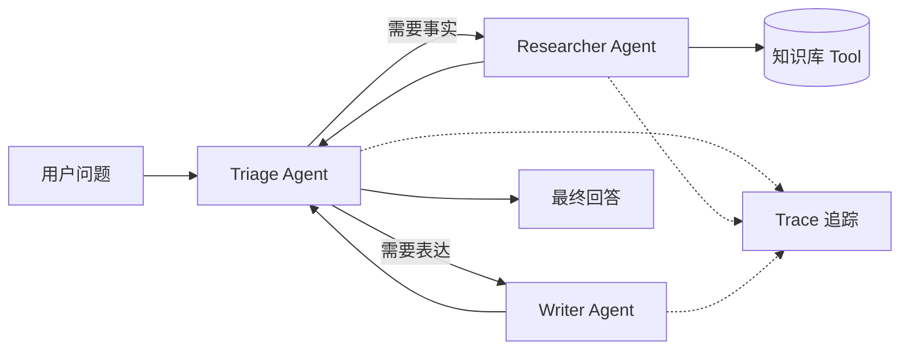

# OpenAI Agents SDK 实战——工具、交接与追踪

> 新一代 Agent 工程不再只是“循环调用模型”。更重要的是：谁负责什么、什么时候调用工具、失败后如何追踪。

## 你要学会什么

本节把一个 Agent 系统拆成四个工程对象：

| 对象 | 作用 | 产品里的例子 |
| --- | --- | --- |
| Agent | 负责一个明确角色 | 研究员、写作者、质检员 |
| Tool | 连接真实世界 | 搜索知识库、查数据库、发工单 |
| Handoff | 任务交接 | 客服转技术支持、研究转写作 |
| Trace | 复盘执行过程 | 找到慢工具、错路由、坏输出 |

## 推荐架构



## 最小实验

```python
from agents import Agent, Runner, function_tool

@function_tool
def search_notes(query: str) -> str:
    return "内部知识库摘要：MCP 让 Agent 通过统一协议发现和调用工具。"

researcher = Agent(
    name="Researcher",
    instructions="你只负责查找事实，并列出来源或依据。",
    tools=[search_notes],
)

writer = Agent(
    name="Writer",
    instructions="你只负责把已有事实整理成清晰中文摘要，不编造来源。",
)

triage = Agent(
    name="Triage",
    instructions="判断用户任务需要研究还是写作；需要事实时交给 Researcher。",
    handoffs=[researcher, writer],
)

result = Runner.run_sync(triage, "整理 MCP 在企业 Agent 中的价值")
print(result.final_output)
```

## 工程判断

| 症状 | 常见原因 | 修正方式 |
| --- | --- | --- |
| Triage 自己回答 | handoff 职责写得太弱 | 在指令中明确“需要事实必须交接” |
| 工具乱调用 | tool 描述过宽 | 用动词命名，参数只保留必要字段 |
| 输出无法复盘 | 没有 trace id | 每次请求生成 request_id/trace_id |
| Agent 互相推诿 | 角色边界重叠 | 每个 Agent 只保留一个主职责 |

## 参考来源

- [OpenAI Agents SDK](https://openai.github.io/openai-agents-python/)
- [OpenAI Agents SDK Tracing](https://openai.github.io/openai-agents-python/tracing/)
- [OpenAI Platform Tools Guide](https://platform.openai.com/docs/guides/tools)

## 自检清单

- 能解释 Agent、Tool、Handoff、Trace 的区别
- 能设计一个三角色 Agent 系统
- 能从 trace 里定位一次失败的工具调用
- 能说明什么时候该拆 Agent，什么时候只用一个 Agent
