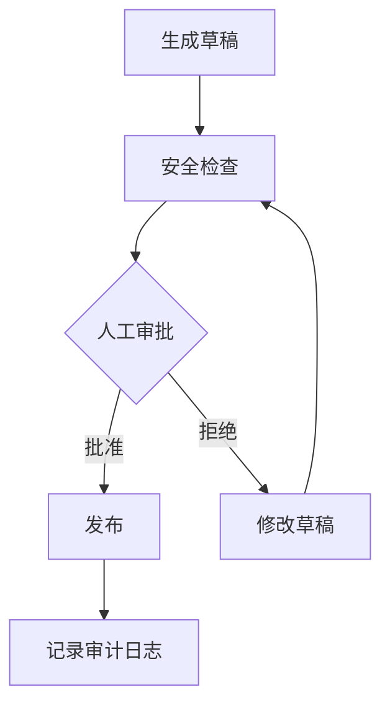

# LangGraph 持久化工作流——让 Agent 不中断

> 真正的企业 Agent 往往不是一次请求就结束：它要等审批、等工具、等人补资料，还要能在失败后恢复。

## 为什么需要持久化

普通聊天式 Agent 遇到这些场景会变脆：

- 发布内容前需要人工批准
- 工具调用耗时很长，用户可能关闭页面
- 金融、法务、人事等动作必须留下审计记录
- 失败后不能从头再跑一遍，因为成本高且可能重复执行副作用

LangGraph 的核心价值是把 Agent 流程变成状态机：节点、边、状态、检查点都可控。

## 审批型工作流



## 最小实验

```python
from langgraph.graph import StateGraph, END
from langgraph.types import interrupt

def draft(state):
    return {"draft": "这是一段待发布内容"}

def approve(state):
    decision = interrupt({
        "draft": state["draft"],
        "question": "是否批准发布？",
    })
    return {"approved": decision == "approve"}

def publish(state):
    if not state["approved"]:
        return {"published": False, "reason": "rejected"}
    return {"published": True}

graph = StateGraph(dict)
graph.add_node("draft", draft)
graph.add_node("approve", approve)
graph.add_node("publish", publish)
graph.set_entry_point("draft")
graph.add_edge("draft", "approve")
graph.add_edge("approve", "publish")
graph.add_edge("publish", END)
```

## 生产化要点

| 能力 | 做法 |
| --- | --- |
| 恢复流程 | 为每次任务固定 thread_id |
| 防重复执行 | 工具节点记录 idempotency key |
| 人工审批 | interrupt 后保存审批上下文 |
| 审计 | 保存输入摘要、审批人、发布时间 |

## 参考来源

- [LangGraph Overview](https://docs.langchain.com/oss/python/langgraph/overview)
- [LangGraph Human-in-the-loop](https://docs.langchain.com/oss/python/langgraph/interrupts)
- [LangGraph Persistence](https://docs.langchain.com/oss/python/langgraph/persistence)

## 自检清单

- 能说清 StateGraph 和普通 chain 的区别
- 能设计一个可暂停、可恢复的审批流程
- 知道 thread_id、checkpoint、interrupt 分别解决什么问题
- 能避免发布、扣款、发邮件这类副作用重复执行
