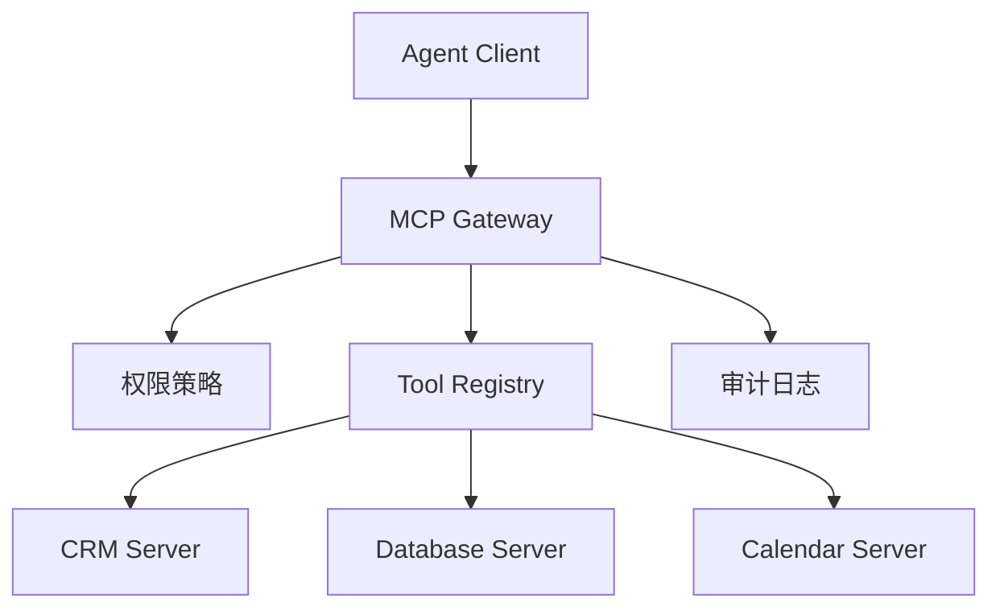

# MCP 工具市场化——从单个 Server 到可治理生态

> MCP 的关键不只是“能连工具”，而是让工具发现、授权、升级、审计变成标准化能力。

## 从 Demo 到平台的差距

| Demo MCP Server | 企业 MCP 平台 |
| --- | --- |
| 本地配置一个 server | 统一工具注册中心 |
| 谁都能调用 | 按用户、团队、环境授权 |
| 手工升级 | 版本、灰度、回滚 |
| 只看成功失败 | 记录参数、耗时、调用者、风险 |

## 平台结构



## 工具治理清单

| 维度 | 检查项 |
| --- | --- |
| 命名 | 工具名是否表达动作和对象 |
| 参数 | 是否用 JSON Schema 限制类型、枚举、范围 |
| 权限 | 是否区分 read/write/delete |
| 数据 | 是否会暴露 PII、密钥、商业机密 |
| 版本 | breaking change 是否新开版本 |
| 审计 | 是否记录 caller、trace_id、tool_args 摘要 |

## 一个工具卡片模板

```yaml
tool:
  name: query_customer_contracts
  version: 1.2.0
  owner: revenue-platform
  risk_level: high
  permissions:
    - contracts:read
  input_schema:
    customer_id: string
    contract_status:
      enum: [active, expired, pending]
  data_policy:
    pii: true
    retention_days: 30
  audit:
    log_args: redacted
    require_trace_id: true
```

## 参考来源

- [Model Context Protocol Specification](https://modelcontextprotocol.io/specification/2025-06-18)
- [MCP Server Concepts](https://modelcontextprotocol.io/docs/concepts/servers)
- [MCP Transports](https://modelcontextprotocol.io/specification/2025-06-18/basic/transports)

## 自检清单

- 能解释 MCP Server、Client、Tool、Resource 的区别
- 能为高风险工具设计最小权限策略
- 能判断一个工具是否适合进入企业工具市场
- 能设计工具版本升级和回滚策略
