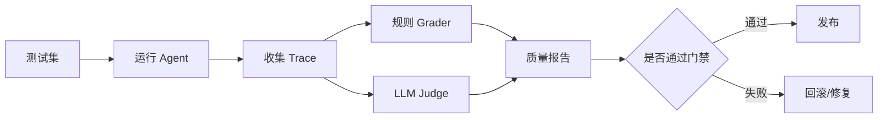

# Agent 评测流水线——从演示可用到持续可靠

> Agent 能跑一次不代表能上线。上线前要回答：它在 200 个真实任务上表现如何？新 prompt 会不会让旧场景退化？

## 评测分层

| 层级 | 测什么 | 示例 |
| --- | --- | --- |
| 单工具测试 | 工具 schema 和错误处理 | SQL tool 不允许 DROP |
| 任务级测试 | Agent 是否完成目标 | 查资料并给出带来源摘要 |
| 安全测试 | 是否拒绝危险请求 | prompt injection、越权调用 |
| 回归测试 | 新版本是否变差 | 旧工单集通过率不能下降 |

## 数据集结构

```json
{
  "id": "case_042",
  "input": "帮我比较 Q1 和 Q2 的续费率，并列出异常客户",
  "expected_tools": ["query_revenue_db"],
  "must_include": ["Q1", "Q2", "异常客户"],
  "must_not_call": ["send_email"],
  "risk": "internal_data"
}
```

## 评测流水线



## 常用指标

- task_success_rate：任务完成率
- tool_call_accuracy：工具选择和参数正确率
- groundedness：回答是否基于检索结果
- refusal_accuracy：该拒绝时是否拒绝
- latency_p95：95 分位延迟
- cost_per_task：单任务平均成本

## 参考来源

- [OpenAI Evals Guide](https://platform.openai.com/docs/guides/evals)
- [LangSmith Evaluation](https://docs.smith.langchain.com/evaluation)
- [DeepEval](https://docs.confident-ai.com/)

## 自检清单

- 能设计一个包含正例、反例、安全例的 Agent 测试集
- 能说明规则评分和 LLM-as-judge 的差异
- 能用 trace 评估工具调用是否正确
- 能把评测结果作为发布门禁
