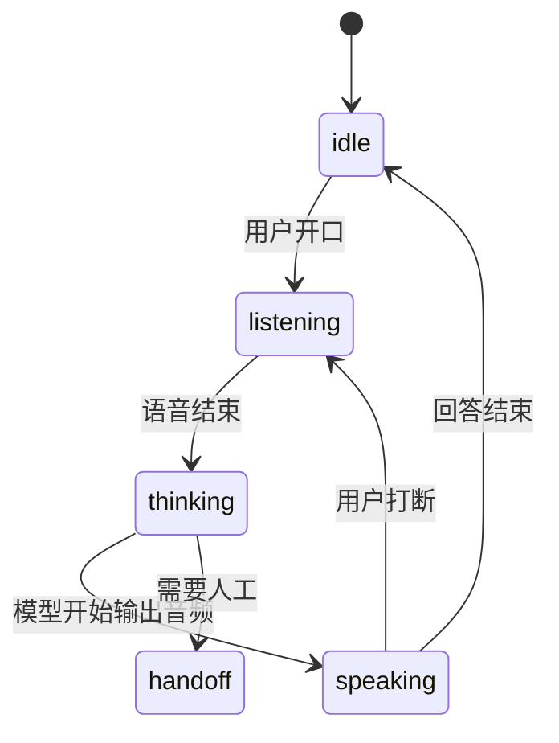

# 实时语音 Agent——低延迟对话产品架构

> 语音 Agent 的体验不是“把文字回答读出来”。它要能听、能打断、能等待工具、能自然接话。

## 核心挑战

| 挑战 | 影响 | 设计重点 |
| --- | --- | --- |
| 低延迟 | 超过 1-2 秒会像断线 | WebRTC、流式响应 |
| 打断 | 用户随时插话 | barge-in、取消旧响应 |
| 轮次判断 | 不要抢话也不要沉默 | VAD、turn detection |
| 工具调用 | 查订单可能很慢 | 进度反馈、短句填充 |
| 转人工 | 高风险或低置信度 | handoff 状态和摘要 |

## 状态机



## 前端状态模板

```ts
type VoiceState = 'idle' | 'listening' | 'thinking' | 'speaking' | 'handoff';

function nextState(state: VoiceState, event: string): VoiceState {
  if (event === 'user_interrupt') return 'listening';
  if (state === 'listening' && event === 'speech_end') return 'thinking';
  if (state === 'thinking' && event === 'model_audio') return 'speaking';
  if (event === 'need_human') return 'handoff';
  if (state === 'speaking' && event === 'audio_done') return 'idle';
  return state;
}
```

## 产品验收标准

- 用户打断后，旧回答必须立即停止
- 工具调用超过 2 秒，必须给语音进度反馈
- 转人工时自动生成上下文摘要
- 每次会话记录音频延迟、打断次数、转人工原因

## 参考来源

- [OpenAI Realtime API](https://platform.openai.com/docs/guides/realtime)
- [OpenAI Realtime WebRTC](https://platform.openai.com/docs/guides/realtime-webrtc)
- [WebRTC](https://webrtc.org/)

## 自检清单

- 能解释语音 Agent 为什么需要状态机
- 能设计用户打断后的取消逻辑
- 能区分流式文本、流式音频和 WebRTC 的适用场景
- 能给语音客服设计转人工条件
