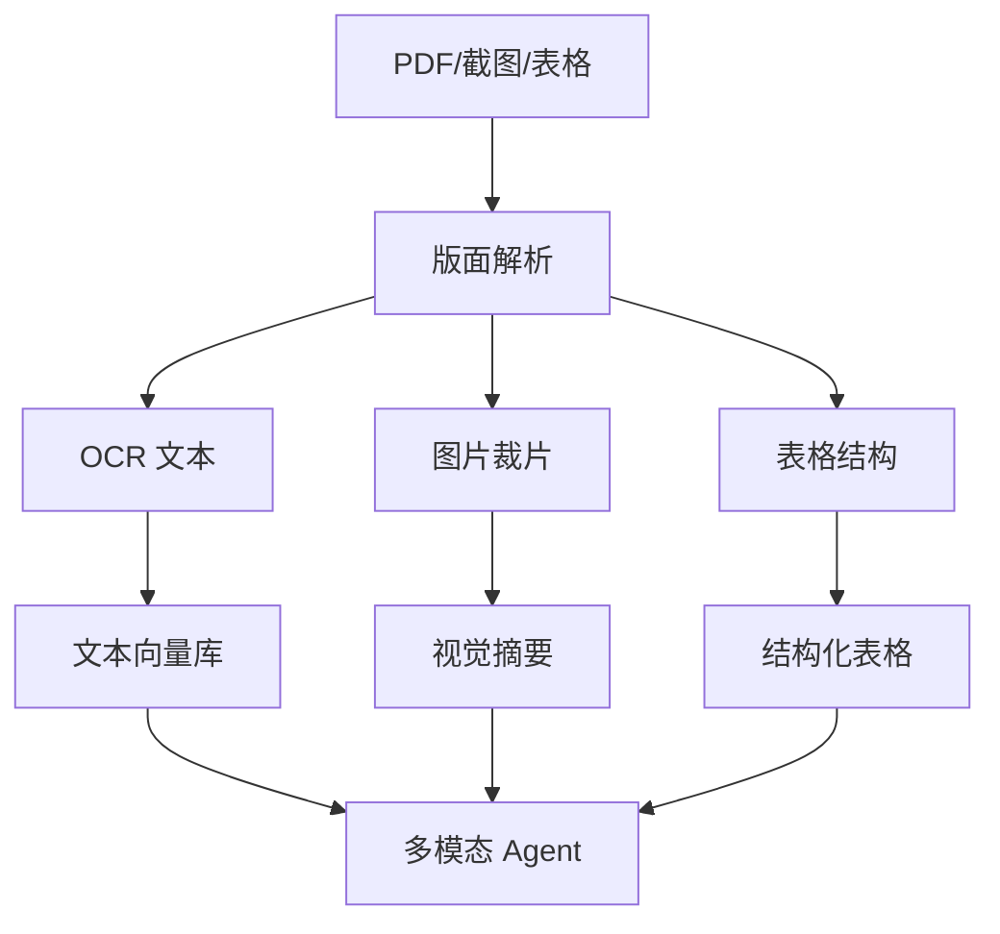

# 多模态文档 Agent——表格、截图、PDF 一起理解

> 企业知识不只在纯文本里：合同 PDF、仪表盘截图、扫描件、表格图片，都需要被 Agent 理解。

## 为什么普通 RAG 不够

普通 RAG 常把 PDF 抽成一串文字，但会丢掉：

- 表格行列关系
- 图表趋势
- 印章、签名、批注
- 截图里的按钮状态和错误提示
- 多栏排版中的阅读顺序

## 推荐流水线

## 检索策略

| 内容类型 | 推荐索引 | 回答时怎么用 |
| --- | --- | --- |
| 正文段落 | 向量 + BM25 | 找依据和引用 |
| 表格 | 结构化存储 | 做计算、筛选、对比 |
| 图表 | 视觉摘要 + 原图裁片 | 解释趋势和异常 |
| 扫描件 | OCR + 坐标 | 回溯原文位置 |

## 质量检查

- 回答必须能指回页码、区域或表格行
- 数字类问题优先走结构化表格，不只靠模型读图
- OCR 低置信度区域要提示人工复核
- 对合同、财务、医疗文档保留审计日志

## 参考来源

- [OpenAI Vision Guide](https://platform.openai.com/docs/guides/vision)
- [LlamaIndex Multimodal](https://docs.llamaindex.ai/en/stable/module_guides/models/multi_modal/)
- [Unstructured Documentation](https://docs.unstructured.io/)

## 自检清单

- 能说出普通 PDF RAG 的三个常见失真点
- 能设计文本、表格、图片三类索引
- 能为回答添加页码或区域级证据
- 能判断什么时候需要人工复核
