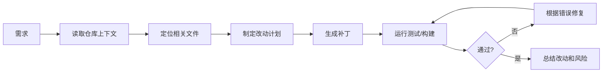

# AI 编程 Agent——从代码补全到任务级开发

> 编程 Agent 的核心不是“写代码快”，而是能读懂仓库、做计划、改小步、跑测试、解释风险。

## 任务级编程 Agent 流程

## 好任务与坏任务

| 类型 | 示例 | Agent 成功率 |
| --- | --- | --- |
| 好任务 | 给现有表单加一个校验字段 | 高 |
| 中等任务 | 重构一个模块并保持 API 兼容 | 中 |
| 坏任务 | “把系统做得更高级一点” | 低 |

## 上下文策略

- 先读入口文件、路由、类型定义，再读具体实现
- 不把整个仓库塞进上下文，优先检索相关文件
- 让 Agent 输出计划，但真正改动保持小步
- 每次 patch 后运行最窄测试，再逐步扩大

## 评测方式

| 指标 | 判断方式 |
| --- | --- |
| patch_apply_rate | 补丁是否能干净应用 |
| test_pass_rate | 原有测试是否通过 |
| requirement_coverage | 是否覆盖需求点 |
| regression_risk | 是否触碰无关模块 |
| explanation_quality | 是否能说明改了什么 |

## 参考来源

- [OpenAI Codex](https://openai.com/codex/)
- [SWE-bench](https://www.swebench.com/)
- [Anthropic Claude Code](https://docs.anthropic.com/en/docs/claude-code/overview)

## 自检清单

- 能把编程 Agent 流程拆成上下文、计划、补丁、测试四步
- 能设计适合 Agent 执行的开发工单
- 能解释为什么小步修改比一次性大改更可靠
- 能用测试和构建结果驱动 Agent 修复
