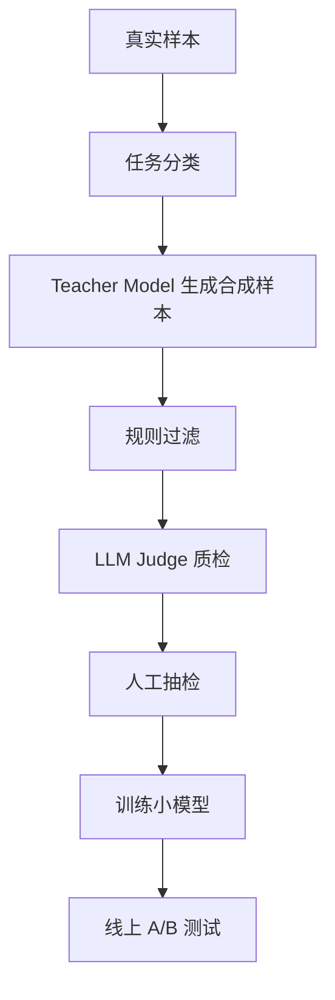

# 合成数据与蒸馏——小模型也能做垂直任务

> 不是所有任务都要上最大模型。垂直任务可以用大模型生成训练数据，再蒸馏到便宜、快速、可私有化的小模型。

## 什么时候适合

适合：

- 任务边界清楚，例如意图分类、信息抽取、客服话术改写
- 有少量高质量真实样本
- 对延迟、成本、私有化有强要求

不适合：

- 任务经常变化
- 标准高度主观
- 需要大量开放世界推理

## 数据生成流水线



## 合成样本模板

```json
{
  "task": "extract_contract_terms",
  "input": "合同文本片段...",
  "output": {
    "party_a": "甲方公司",
    "party_b": "乙方公司",
    "renewal_clause": "自动续约一年",
    "termination_notice_days": 30
  },
  "quality_tags": ["complete", "domain_valid"],
  "source": "synthetic_teacher_v1"
}
```

## 关键风险

| 风险 | 后果 | 控制方式 |
| --- | --- | --- |
| 合成数据单一 | 小模型泛化差 | 按场景、难度、噪声分层生成 |
| Teacher 幻觉 | 错误被学生继承 | 规则过滤 + 人工抽检 |
| 评测集污染 | 指标虚高 | 真实评测集隔离保存 |
| 风格过拟合 | 输出机械 | 混入真实样本和多风格样本 |

## 参考来源

- [Hugging Face TRL](https://huggingface.co/docs/trl/index)
- [Hugging Face PEFT](https://huggingface.co/docs/peft/index)
- [OpenAI Fine-tuning Guide](https://platform.openai.com/docs/guides/fine-tuning)

## 自检清单

- 能判断一个任务是否适合蒸馏到小模型
- 能设计合成数据生成、过滤、抽检流水线
- 能解释为什么评测集必须和合成训练集隔离
- 能说出合成数据的主要质量风险
